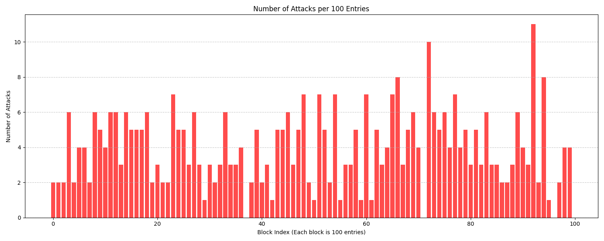

# Network Intrusion Detection using Ensemble Learning

An AI-powered Intrusion Detection System (IDS) designed to classify network traffic as **Benign** or **Malicious**. This project implements a full machine learning pipeline, from raw log processing and behavioral feature engineering to optimized ensemble modeling.

## 🚀 Overview
Traditional security systems often miss novel "zero-day" attacks. This project leverages **Ensemble Learning** (Random Forest, XGBoost) and **SMOTE** (Synthetic Minority Over-sampling Technique) to detect anomalies in highly imbalanced network data (96% benign vs. 4% attack).

### Key Features:
- **Behavioral Feature Engineering**: Extracts signals from URLs (length, special characters) and User-Agent strings (bot detection).
- **Imbalance Handling**: Uses SMOTE to handle the extreme 96:4 class distribution.
- **Dynamic Model Auditing**: Custom tools to evaluate model performance across different train/test splits and probability thresholds.
- **Syllabus Alignment**: Maps core ML concepts (Classification, Ensembles, Evaluation) to a real-world cybersecurity use case.

---

## 📂 Project Structure
```text
├── cybersecurity.csv       # Primary Dataset
├── src/                    # Implementation scripts
│   ├── baseline_ids.py     # Initial models (Logistic Regression, KNN, SVM)
│   ├── ids_enhanced.py     # Added Feature Engineering & SMOTE
│   └── ids_final_optimized.py # Final GridSearchCV & Cross-Validation
├── dynamic_evaluate.py     # CLI tool for testing custom splits and thresholds
├── find_optimal_params.py  # Grid search tool to find best split/threshold combo
├── generate_attack_graph.py # Visualizes attack distribution in 100-entry blocks
├── outputs/                # Visualizations & Metrics (Plots, JSON results)
├── presentation/           # Materials for project walkthrough
├── Project_Report.md       # Comprehensive technical documentation
├── Project_Mapping.md      # Mapping project to ML syllabus
└── predict_custom.py       # Script for testing on new/custom data
```

---

## 🛠️ Installation & Usage

### 1. Setup Environment
```bash
# Create and activate virtual environment
python -m venv venv
source venv/bin/activate  # On Windows: venv\Scripts\activate

# Install dependencies
pip install pandas numpy matplotlib seaborn scikit-learn xgboost imbalanced-learn
```

### 2. Run the Analysis Tools
- **Find Optimal Split/Threshold**:
  ```bash
  python find_optimal_params.py
  ```
- **Dynamic Evaluation**:
  ```bash
  python dynamic_evaluate.py --split 0.3 --threshold 0.5
  ```
- **Generate Attack Distribution Graph**:
  ```bash
  python generate_attack_graph.py
  ```

---

## 📊 Results & Findings

### Optimal Model Configuration
Through automated grid search (`find_optimal_params.py`), the ideal configuration for this dataset was identified as:
- **Test Split**: 30% (70/30 Train/Test)
- **Classification Threshold**: 0.5
- **Top F1-Score**: 0.5209

### Attack Distribution
The following graph (generated via `generate_attack_graph.py`) shows the distribution of actual attacks across the dataset in blocks of 100 entries ("classes"). This visualization helps identify temporal bursts of malicious activity.



### Key Indicators
`url_special_chars`, `url_length`, and `is_bot` remain the most significant features for identifying malicious intent.

---

## 📝 Documentation
- **[Technical Report](Project_Report.md)**: Detailed methodology, EDA, and result analysis.
- **[Syllabus Mapping](Project_Mapping.md)**: How this project covers ML modules (Ensembles, Entropy, Bias-Variance, etc.).
- **[Presentation Guide](presentation/Presentation_Guide.md)**: Summary for viva/presentation.

---
**Course:** Machine Learning [CSE-4408]  
**Topic:** Ensemble Learning in Cybersecurity
